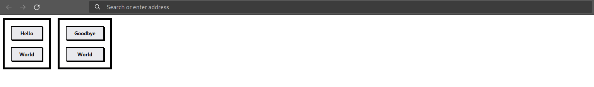

# Toph

🏗️ WIP 🏗️ 

Server-side html templating in Rust.

Here is an example to whet your appetite:



```rust
use toph::component::{stack, cluster};
use toph::tag::{div_, body_, button_, head_, html_, doctype_};
use toph::{Node, attr};

const BUTTON: &str = "
button {
  padding: 0.5rem 1.25rem;
  font-weight: bold;
  border: 2px solid black;
  box-shadow: 2px 2px black;
}";

const CARD: &str = ".card { padding: 1rem; border: 5px solid black; }";

pub fn custom_card<I: IntoIterator<Item = N>, N>(children: I) -> Node
where
    N: Into<Node>,
{
    div_.with(attr![class = "card"])
        .stylesheet(CARD)
        .set(children)
}

fn main() {
    let button = |text: &str| button_.set([text]).stylesheet(BUTTON);
    let left = custom_card([stack(3, [button("Hello"), button("World")])]);
    let right = custom_card([stack(3, [button("Goodbye"), button("World")])]);
    let html = [
        doctype_,
        html_.set([head_, body_.set([cluster(3, [left, right])])]),
    ];

    std::fs::write("components.html", Node::render(html)).unwrap();
}
```
